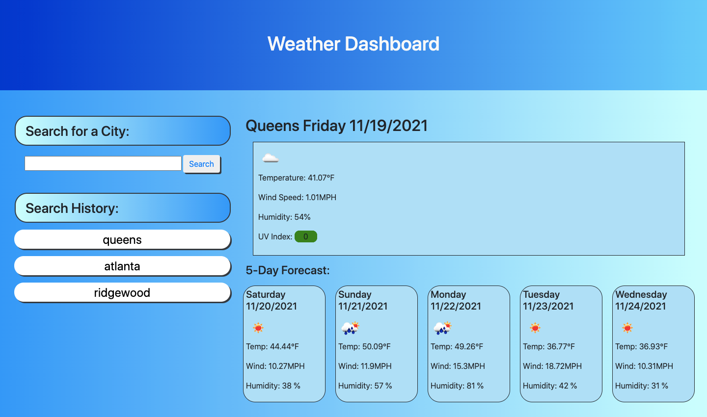

# Weather-Dashboard

## **Description**

Made a weather dashboard where users can search for the weather outlook of multiple cities so that they can plan a trip accordingly.

**HTML and CSS**

The focus of this project was to feature dynamically updated HTML and CSS. The static features were built using HTML and CSS. Bootstrap was used to build the grid layout.

**JavaScript**

When users enter their desired city into the form input, they are presented with the current forecast along with a 5-day forecast. Both the current and future forecasts will display the date, weather icon, temperature, wind and humidity. Additionaly, for the current forecast, it will display the UV index showing the colors green (favorable), orange (moderate), and red (severe) to indicate the severity.

Clicking the city in the search history will again present the users with the current and future forecasts of that city.

## **Screenshot**

## **Github Page Link**

[Link to Github Page!](https://bchen41.github.io/Weather-Dashboard/)

Author: Betty Chen
